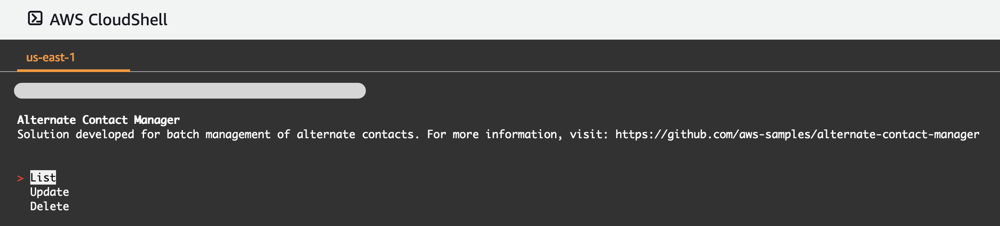
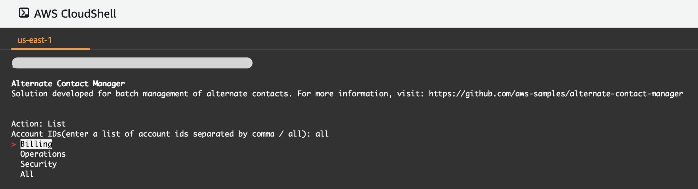
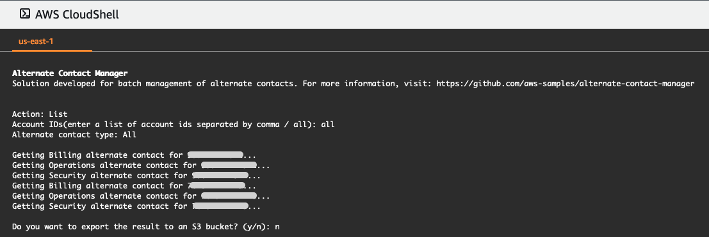
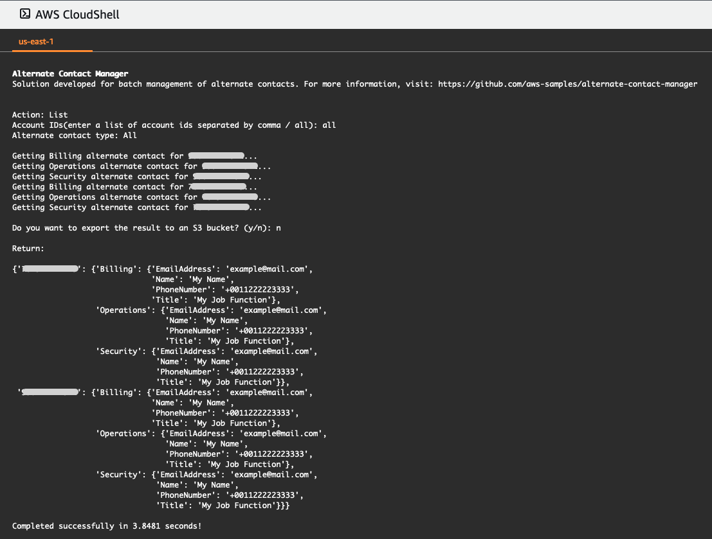
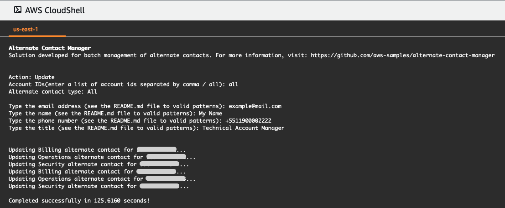

# AWS Organizations Alternate Contact Manager 

### Programmatically manage alternate contacts in member accounts of an AWS Organizations 

In this repository, we share code for batch management of alternate contacts from your AWS accounts in an [AWS Organizations](https://aws.amazon.com/organizations/). [Here](https://docs.aws.amazon.com/awsaccountbilling/latest/aboutv2/manage-account-payment.html#manage-account-payment-alternate-contacts) are some use cases and the importance of always keeping your Alternate Contacts data up to date.

Reference: [Programmatically managing alternate contacts on member accounts with AWS Organizations](https://aws.amazon.com/blogs/mt/programmatically-managing-alternate-contacts-on-member-accounts-with-aws-organizations/)

### [Requirements](https://docs.aws.amazon.com/accounts/latest/reference/manage-acct-update-contact.html#update-alternate-contact-requirement)

- Your organization must enable all features to manage settings on your member accounts. This allows admin control over the member accounts. This is set by default when you create your organization. If your organization is set to consolidated billing only, and you want to enable all features,” see [Enabling all features in your organization](https://docs.aws.amazon.com/organizations/latest/userguide/orgs_manage_org_support-all-features.html).
- You need to enable trusted access for AWS Account Management service. To set this up, see [Enabling trusted access for AWS Account Management](https://docs.aws.amazon.com/accounts/latest/reference/using-orgs-trusted-access.html).

### How to run

1. Open CloudShell

    

2. When CloudShell opens, we will run the following command:

   1. For the first time, we will run the following command to download all dependencies:

          wget https://raw.githubusercontent.com/aws-samples/aws-organizations-alternate-contact-manager/main/deploy.sh
          chmod +x deploy.sh
          ./deploy.sh

    2. For the next times we can just run: 

           python3 script.py

3. After running the above commands in CloudShell, the first step is to choose one of the 3 action options.

    

4. Second step is to input a list of account ids separated by comma or all. For the Delete action, for security reasons, it is only possible to run one account id at a time. Below are some input examples:

    - all
    - 000000000000,111111111111,222222222222,333333333333
    - 000000000000, 111111111111, 222222222222, 333333333333
    - 012345678910 _(valid for Delete action)_

5. The third step is to choose which type of alternate contact.

    

    #### 6. List

    1. For List action, there is the option to export the result to an s3 bucket.

         
     
    2. Inputting "y" will ask for the name of an S3 bucket to upload. Inputting "n", the result will return on the CloudShell screen. 

         

    #### 7. Update

    1. For Update action, it will be required to fill in all the contact fields, if you must pay attention to the correct pattern. Below are some input examples:
        - Email: example@mail.com
        - Name: My Name
        - Phone number: +5511900002222
        - Title: Technical Account Manager

        
    
    #### 8. Delete

    1. For the Delete action, for security reasons, it is only possible to run one account id at a time.

        